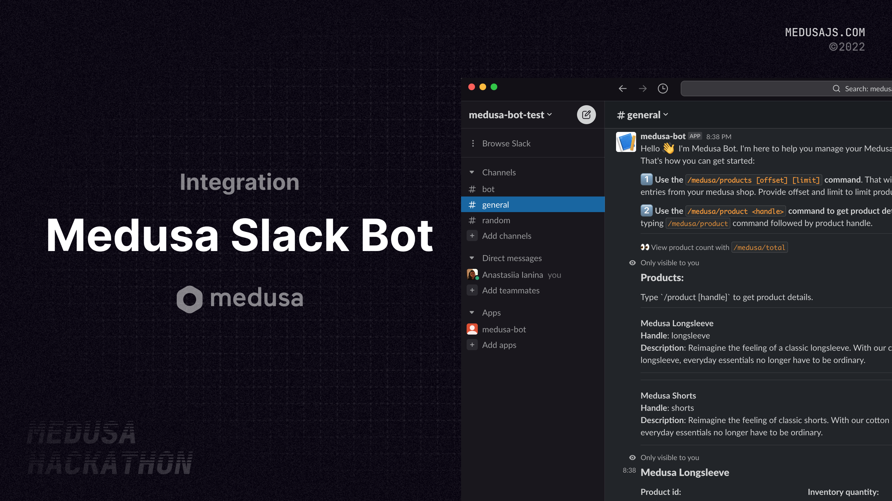
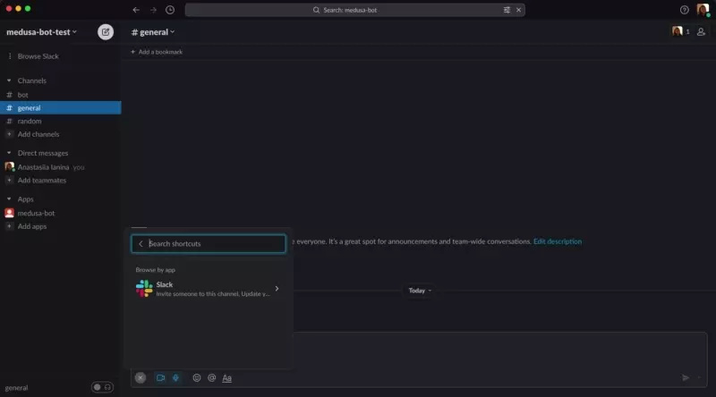
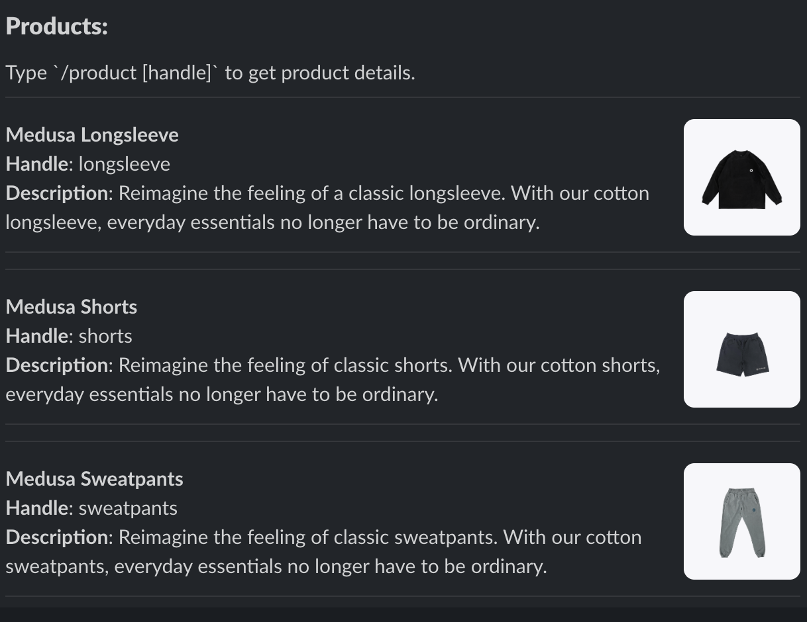
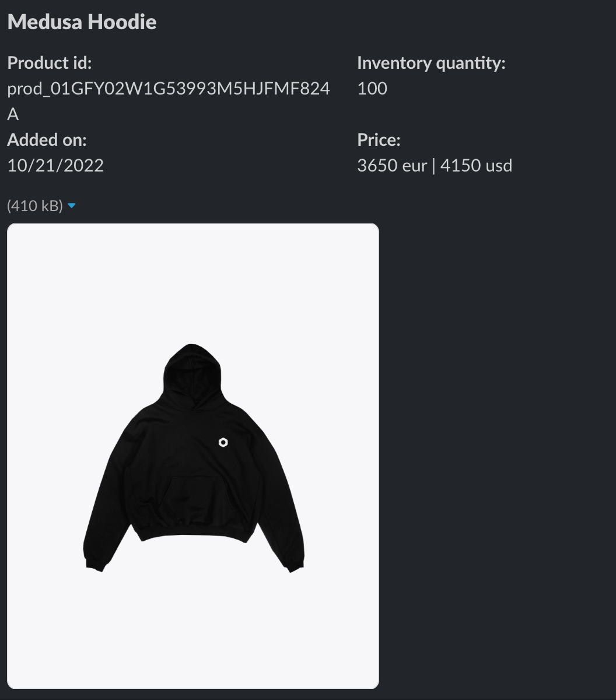
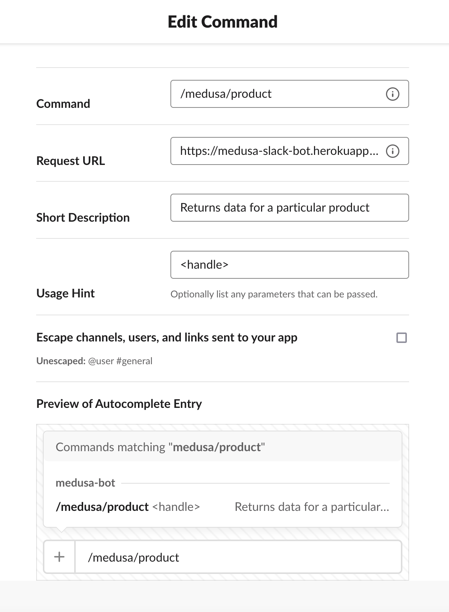
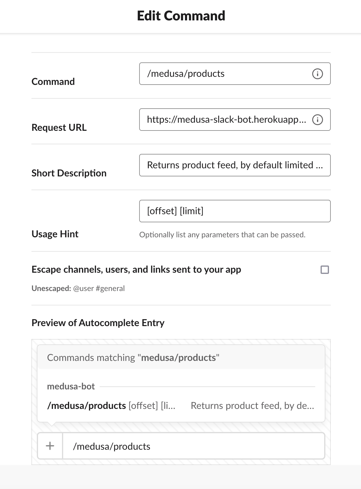

  

<h1 align="center">
  Medusa Slack Bot example
</h1>

Medusa starter with integrated Slack</a>

  

    
  

## Medusa Slack Bot 

### Demo Link

For demo purposes this submission was deployed to Heroku.
To see it in action, you can use the following commands:

- Get product information by product handle:
`curl -d "text=hoodie" -X POST https://medusa-slack-bot.herokuapp.com/slack/product_by_handle`
Parameter: product handle

- Get product feed:
`curl -d "text=2 2" -X POST https://medusa-slack-bot.herokuapp.com/slack/products`
Parameters: offset and limit (default offset=0 and limit=10)

 To see how it looks in Slack, copy the output and paste it to [Slack Block Kit Builder](https://app.slack.com/block-kit-builder)

Or you can create a new Slack bot and add the following slash command - endpoint pairs to get exactly same functionality as seen in this demo.
Slash command | Request URL | Description
--- | --- | ---
/medusa/product | https://medusa-slack-bot.herokuapp.com/slack/product_by_handle | Returns data for a particular product
/medusa | https://medusa-slack-bot.herokuapp.com/start | Quickstart guide
/medusa/total | https://medusa-slack-bot.herokuapp.com/slack/products/total | Display the total number of products
/medusa/products | https://medusa-slack-bot.herokuapp.com/slack/products | Returns product feed, by default limited by 10 items. Provide limit and offset to get a particular range.

### About

### Participants

- GitHub: [yanina-nas](https://github.com/yanina-nas)
- Twitter: [@AnastasiiaIani1](https://twitter.com/AnastasiiaIani1)
- Discord: yanina-nas#5541
### Description

This example demonstrates how you can connect your Medusa store to Slack workspace by creating a bot application. Functionality of this demo includes querying your shop's data from your Slack chat and displaying detailed information in a user-friendly fashion about a product from your store by a product handle. This was implemented by creating a few custom endpoints in a Medusa backend, transforming product data received by produt service, and sending it back to be consumed by Slack.

### Preview

Product feed:

Product overview:

After setting up your API in a Medusa backend, your endpoints can be added to a Slack app and configured as shown below:

Overview: 

Slash command example setup:

## Set up Project

To run this project please follow the steps listed below.

### Prerequisites

- Heroku account
- Slack account & workspace

### Install Project

- Press the `Deploy to Heroku` button (at the top of this readme)
    - It'll deploy a heroku application with addons for redis and postgres.
- Run `npm run seed` to seed example data.
- Create a Slack app (option `from scratch`).
    - Enable `Slash Commands` feature for your app.
    - Add aforementioned commands to it.
    - Add your app to your Slack workspace.
## Resources

- [Deploy to Heroku branch of Medusa default starter repo](https://github.com/medusajs/medusa-starter-default/tree/feat/deploy-heroku)
- [Medusa Services](https://docs.medusajs.com/advanced/backend/services/create-service) (like [productService](https://docs.medusajs.com/references/services/classes/ProductService))
- [Medusa Endpoints](https://docs.medusajs.com/advanced/backend/endpoints/add)
- [Slack Slash Commands](https://api.slack.com/interactivity/slash-commands)
